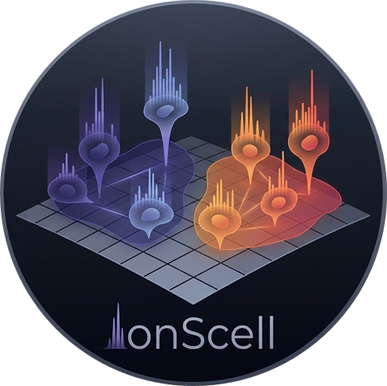

<p align="center">
  
</p>

<h1 align="center">IonScell</h1>
<p align="center"><em>Single-Cell Mass Spectrometry Imaging — End-to-End Analysis Pipeline</em></p>

<p align="center">
  
  
  <a href="https://doi.org/10.5281/zenodo.20070096">
    
  </a>
</p>

<p align="center">
  <a href="https://colab.research.google.com/github/yanisZirem/ionScell/blob/main/ionScell_notebook.ipynb">
    
  </a>
</p>

---

## Overview

**IonScell** is a Python pipeline for **Single-Cell Mass Spectrometry Imaging (SCMSI)**. It processes raw imzML files acquired on MALDI, DESI, SpiderMass-imaging or other MSI platforms and performs the full analytical workflow, from data loading, single cells isolation, cells populations analysis through soft clustering and quality control, to lipid/metabolite annotation and export.

IonScell is available in two complementary formats in this repository:

| Format | Best for |
|--------|----------|
| **Jupyter Notebook** (`ionScell_notebook.ipynb`) | Step-by-step exploratory analysis, publication figures |
| **Python class** (`ionscell_pipeline.py`) | Integration into existing pipelines, scripting |

The **IonScell Desktop GUI** is distributed separately — download it here:  
📥 [https://nextcloud.univ-lille.fr/index.php/f/384061741](https://nextcloud.univ-lille.fr/index.php/f/384061741)

---

## 🗂️ Test Datasets

All datasets used to develop and validate IonScell are publicly available on Zenodo:

> **Single-cell MALDI-MSI datasets of breast cancer and glioblastoma cell lines for ionScell validation**  
> Zirem Y., Ledoux L., Defrance J., Lagache L., Fournier I., Salzet M. — PRISM U1192  
> [](https://doi.org/10.5281/zenodo.20070096)

The repository contains MALDI-MSI acquisitions (Bruker rapifleX, 10 µm, m/z 350–1100, centroid imzML/ibd) of cytospin-deposited human cell lines in both positive and negative ionisation modes:

- **AU565** — HER2-positive breast cancer
- **MDA-MB-231** — triple-negative breast cancer
- **MCF7** — luminal breast cancer
- **NCH82** — glioblastoma
- **AU565 + NCH82** ⭐ — binary mixed population (pos + neg)
- **AU565 + NCH82 + MDA-MB-231** — ternary mixed population (pos + neg)

> 💡 **Start with `au565_nch82_neg` or `au565_nch82_pos`** — the binary mixed cell datasets are the smallest files (~57 MB and ~180 MB combined) and are ideal for a first run. They demonstrate IonScell's ability to resolve molecularly distinct cell populations via soft clustering.

---

## Key Features

- **Flexible m/z binning** — Fixed (0.1 Da) or adaptive (instrument-matched ppm resolution)
- **Adaptive TIC thresholding** — 8 algorithms (GMM, Otsu, Triangle, Li, Yen, …) with automatic selection
- **Cell segmentation** — Watershed and DFS algorithms with size filtering in pixels or µm
- **Soft clustering** — Gaussian Mixture Models (GMM) and Fuzzy C-Means (FCM) with probabilistic membership
- **Quality control** — SNR, sparsity, dynamic range, spectral entropy, number of detected peaks
- **Clone quality assessment** — Confidence scores, within-clone CV, between-clone separability
- **Differential analysis** — Kruskal-Wallis or ANOVA with BH FDR correction, volcano plots, Z-score heatmaps
- **Ion spatial mapping** — Single-ion and multi-ion overlay with cell contours
- **Lipid annotation** — Embedded LIPID MAPS / HMDB database, no internet required, adduct-aware
- **Export** — CSV (metadata + spectra), imzML

---

## Installation

### 1. Clone the repository

```bash
git clone https://github.com/yanisZirem/ionScell.git
cd ionScell
```

### 2. Create a dedicated environment (recommended)

```bash
conda create -n ionscell python=3.10 -y
conda activate ionscell
```

### 3. Install dependencies

```bash
pip install -r requirements.txt
```

Optional (for Fuzzy C-Means):
```bash
pip install scikit-fuzzy
```

---

## Quick Start

### Option A — Jupyter Notebook (local)

```bash
jupyter notebook ionScell_notebook.ipynb
```

### Option B — Google Colab *(no installation required)*

Click the badge to open the notebook directly in Colab:

<p align="center">
  <a href="https://colab.research.google.com/github/yanisZirem/ionScell/blob/main/ionScell_notebook.ipynb">
    
  </a>
</p>

**Step 0** of the notebook auto-detects Colab, installs all dependencies, and lets you upload your data or download the test dataset directly from Zenodo.

### Option C — Python script

```python
from ionscell_pipeline import SCMSIPipeline, LipidAnnotator

pipe = SCMSIPipeline()
pipe.load_imzml("data/au565_nch82_neg.imzML")
pipe.build_datacube(mz_min=350, mz_max=1100, mz_bin=0.1, normalization="TIC")

thresh, _ = pipe.auto_TIC_threshold(method='auto')
pipe.watershed_or_dfs_from_mask(TIC_threshold=thresh, method='watershed',
                                 min_cell_size=4, pixel_size_um=10)

pipe.extract_cell_spectra(agg='mean')
pipe.compute_spectral_quality_metrics()
pipe.filter_low_quality_cells(snr_threshold=2.0)

pipe.compute_soft_clustering(n_clusters=None, max_clusters=8)
pipe.assess_clone_quality()

pipe.show_umap_with_quality_overlay()
pipe.overlay_clusters_on_image_plotly()
pipe.plot_clone_spectra_with_uncertainty()

top_markers, _ = pipe.run_differential_analysis(method='kruskal')
ann_df, enrichment = pipe.annotate_ions(mode='neg', ppm_tolerance=10.0)

pipe.export_cells_to_csv("results/cells.csv")
```

### Option D — Desktop GUI *(no Python required)*

📥 [Download IonScell GUI](https://nextcloud.univ-lille.fr/index.php/f/384061741) — extract and launch `ionScell.exe`.  
See `docs/user_manual_interface.md` for the full guide.

---

## Pipeline Architecture

```
imzML file
    │
    ▼
load_imzml()
    │
    ▼
make_mz_axis() / build_adaptive_mz_axis()
    │
    ▼
build_datacube()             ← normalization: TIC / RMS / MEDIAN
    │
    ▼
auto_TIC_threshold()         ← 8 algorithms, automatic selection
    │
    ▼
watershed_or_dfs_from_mask() ← Watershed or DFS
    │                           ← size filtering (px or µm)
    ├── remove_cells()          ← manual artefact removal
    │
    ▼
extract_cell_spectra()       ← mean / median / sum per cell
    │
    ▼
compute_spectral_quality_metrics()
filter_low_quality_cells()
    │
    ▼
compute_soft_clustering()        ← GMM (auto k via BIC/silhouette)
  or compute_fuzzy_cmeans()      ← FCM
    │
    ▼
assess_clone_quality()
    │
    ├── show_umap_with_quality_overlay()
    ├── overlay_clusters_on_image_plotly()
    ├── plot_clone_spectra_with_uncertainty()
    ├── show_mz_distribution_in_cells_plotly()
    ├── plot_multi_ion_overlay()
    ├── plot_distribution_by_clone()
    │
    ▼
run_differential_analysis()  ← Kruskal-Wallis / ANOVA + BH FDR
    │
    ▼
annotate_ions()              ← LipidAnnotator (embedded DB)
    │
    ▼
export_cells_to_csv()
export_cells_to_imzML()
```

---

## API Reference

### `SCMSIPipeline`

#### Data loading & cube building

| Method | Description |
|--------|-------------|
| `load_imzml(path)` | Load imzML file |
| `make_mz_axis(mz_min, mz_max, mz_bin)` | Fixed-grid m/z axis |
| `build_adaptive_mz_axis(...)` | Instrument-matched adaptive binning |
| `build_datacube(mz_min, mz_max, normalization)` | Build 3D data cube |

#### Thresholding & segmentation

| Method | Description |
|--------|-------------|
| `auto_TIC_threshold(method)` | Adaptive TIC threshold (8 methods + auto) |
| `watershed_or_dfs_from_mask(...)` | Cell segmentation |
| `remove_cells(remove_ids)` | Remove artefact cells |

#### Spectral extraction & QC

| Method | Description |
|--------|-------------|
| `extract_cell_spectra(agg)` | One spectrum per cell |
| `compute_spectral_quality_metrics()` | SNR, entropy, sparsity, … |
| `filter_low_quality_cells(...)` | Flag/remove low-quality cells |

#### Clustering

| Method | Description |
|--------|-------------|
| `compute_soft_clustering(n_clusters)` | GMM soft clustering |
| `compute_fuzzy_cmeans(max_clusters)` | Fuzzy C-Means |
| `assess_clone_quality()` | Quality report per clone |

#### Clone management

| Method | Description |
|--------|-------------|
| `remove_clone(clone_id)` | Remove entire clone |
| `combine_clones(clone_ids)` | Merge clones |
| `remove_clusters(clusters_to_remove)` | Remove by cluster ID |

#### Visualisation

| Method | Description |
|--------|-------------|
| `show_TIC_plotly()` | TIC heatmap |
| `show_umap_with_quality_overlay()` | UMAP coloured by clone + confidence |
| `overlay_clusters_on_image_plotly()` | Spatial clone map |
| `plot_cell_contours_by_clone()` | Contours on white/TIC background |
| `plot_clone_spectra_with_uncertainty()` | Mean spectra ± SD |
| `plot_global_spectrum()` | Global mean spectrum |
| `show_mz_distribution_in_cells_plotly(mz_value)` | Single-ion map |
| `plot_multi_ion_overlay(mz_list)` | Multi-ion RGB overlay |
| `plot_distribution_by_clone(mz_value)` | Violin/box plots |

#### Analysis & export

| Method | Description |
|--------|-------------|
| `run_differential_analysis(method)` | Statistical DA + volcano + heatmap |
| `annotate_ions(mode, ppm_tolerance)` | Lipid/metabolite annotation |
| `export_cells_to_csv(path)` | Export to CSV |
| `export_cells_to_imzML(path)` | Export to imzML |

---

### `LipidAnnotator`

```python
ann = LipidAnnotator(mode='pos', ppm_tolerance=5.0)
hits = ann.annotate_peak(800.56)
df   = ann.annotate_peak_list(mz_array)
results, enrichment = ann.annotate_clones(pipeline)
df   = ann.search("ceramide")
```

**Positive adducts:** `[M+H]+`, `[M+Na]+`, `[M+K]+`, `[M+NH4]+`, `[M+Li]+`, `[M+H-H2O]+`, `[M+2H]2+`  
**Negative adducts:** `[M-H]-`, `[M+Cl]-`, `[M+FA-H]-`, `[M+Ac-H]-`, `[M-H-H2O]-`, `[M+Br]-`, `[M-2H]2-`

---

## Repository Structure

```
ionScell/
├── ionscell_pipeline.py          ← SCMSIPipeline + LipidAnnotator class
├── ionScell_notebook.ipynb       ← Jupyter notebook (imports class)
├── requirements.txt
├── README.md
├── logo.png
└── docs/
    ├── user_manual_jupyter.md    ← Jupyter + Google Colab user manual
    └── user_manual_interface.md  ← Desktop GUI user manual
```

---

## Supported Instruments & Formats

| Instrument | Format | Notes |
|-----------|--------|-------|
| MALDI-TOF/TOF | imzML | Continuous or processed mode |
| MALDI-Orbitrap | imzML | Use adaptive binning for best annotation |
| DESI-MS | imzML | |
| SIMS | imzML | |

---

## Citation

IonScell is currently under reviewer revision.

If you use the test datasets, please cite:

> Zirem Y., Ledoux L., Defrance J., Lagache L., Fournier I., Salzet M.  
> *Single-cell MALDI-MSI datasets of breast cancer and glioblastoma cell lines for ionScell validation*, Zenodo, 2026.  
> [](https://doi.org/10.5281/zenodo.20070096)

---

## License

MIT License — see `LICENSE` for details.

---

## Contact

📬 yanis.zirem@univ-lille.fr — yanis.zirem2016@univ-lille.fr  
🐛 Issues & feature requests: [github.com/yanisZirem/ionScell/issues](https://github.com/yanisZirem/ionScell/issues)
